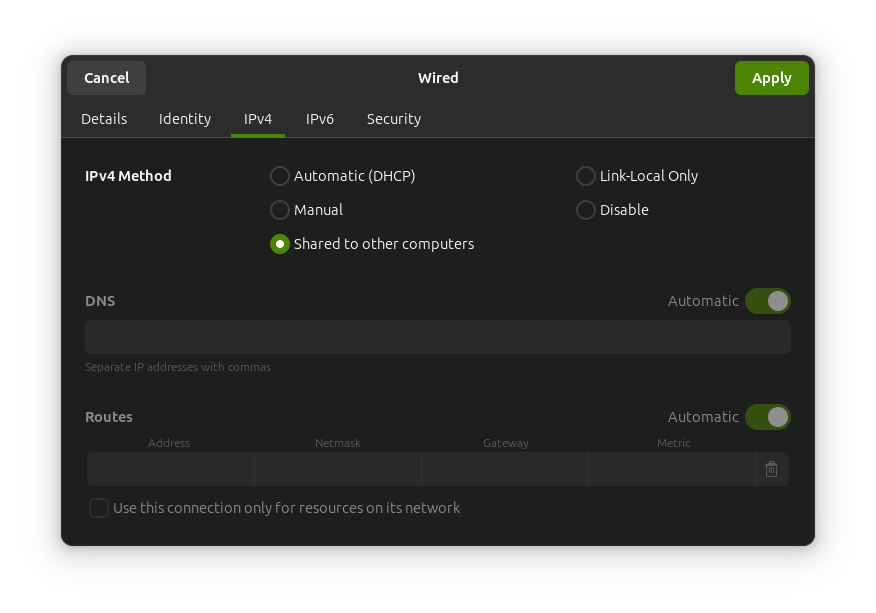
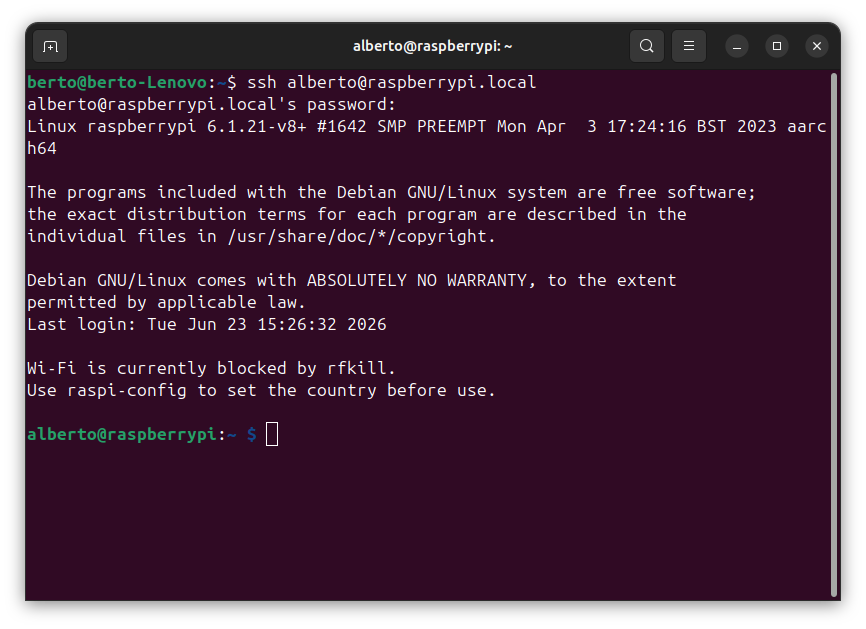
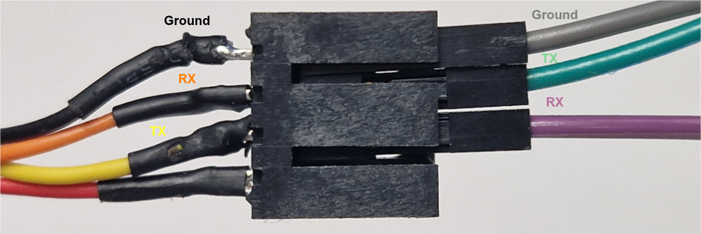
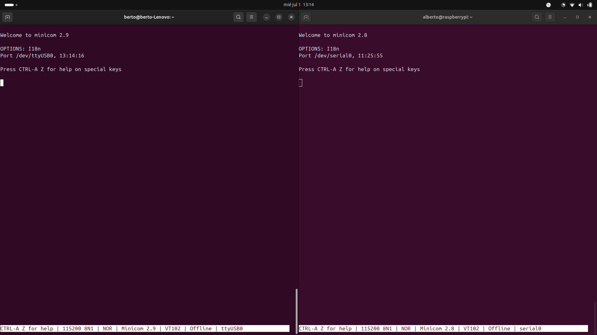
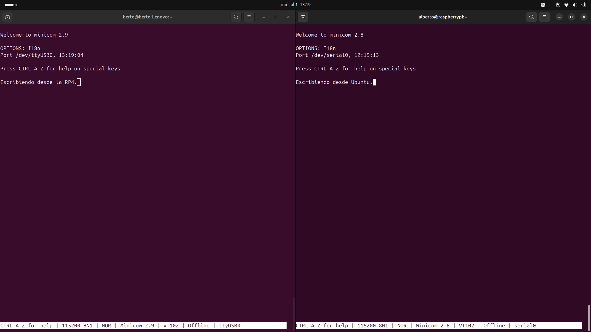

# Algunas instrucciones de uso para usar la Raspberry Pi como emulador

Todo este guión está pensado para realizar la comunicación entre una máquina *Ubuntu 24.04.4 LTS* y una *Raspberry Pi 4 Model B* con el [sistema operativo oficial](https://www.raspberrypi.com/documentation/computers/getting-started.html) de esta plataforma.

## Conexión `ssh`

Para trabajar cómodamente con la Raspberry y transmitir información como si de 2 ordenadores en red se tratase se propone usar `ssh`. A continuación, se detallan cosas a tener en cuenta. 

### Establecer conexión `ssh` entre la Raspberry y la máquina Ubuntu. 

Hay muchas maneras de realizar este proyecto. Se podría hacer todo desde la propia Raspberry como si de un ordenador normal se tratase. Sin embargo, lo más cómodo en este caso es conectarse desde otra máquina más potente a la Raspberry mediante ssh (utilizando un cable ethernet entre ambos dispositivos). Para ello hay que seguir 3 pasos sencillos:
* Configurar la conexión por ethernet de forma correcta (ver imagen inferior)

* Conectar el cable de red entre los dispositivos

* Abrir un terminal y escribir `ssh NOMBRE_USUARIO_RASPBERRY@raspberrypi.local`. A continuación, poner la contraseña que se estableció para ese sistema y ya debería dejarnos entrar:

### Envío de archivos entre portátil y raspberry pi mediante `ssh`

Hay varios métodos, pero se pueden resumir en:
* Terminal (usar `scp` o `sftp`)
* Método gráfico. Básicamente conectarse a la RPi4 como si fuese un maquina externa a través del explorador de archivos. Los pasos a seguir son:
  1. Abre tu explorador de archivos normal.
  2. En la barra lateral izquierda, haz clic en "+ Otras ubicaciones" (Other Locations).
  3. Abajo del todo, verás una barra que dice "Conectar al servidor".
  4. Escribe la dirección en este formato: `sftp://NOMBRE_USUARIO_RASPBERRY@raspberrypi.local`
  5. Haz clic en Conectar. Te pedirá el usuario y la contraseña.
  6. ¡Listo! Verás los archivos de la Raspberry Pi como si fuera un pendrive conectado a tu portátil y podrás copiar, pegar y borrar con el ratón.

## Uso del puerto serie

Para realizar la emulación de este proyecto se van a utilizar los pies conectados a la UART de la Raspberry. A continuación, se explicarán varias cosas a tener en cuenta antes de comenzar a usar el puerto serie.

### Configuración previa en la Rapsberry Pi 4 model B

Para usar el puerto serie hay que configurarlo previamente. Se recomienda ver el siguiente [vídeo](https://www.youtube.com/watch?v=oevxqPk78sM) donde se explica como configurar el puerto serie en la Rapsberry Pi 4.

### Envío sencillo de datos entre el portátil y la Raspberry

Antes de emular nada, es conveniente realizar una transmisión, utilizando el puerto serie, entre máquinas. De esta manera, podemos comprobar que los cables están correctamente conectados y que todo funciona correctamente.

Para ello usaremos la herramienta *minicom*. Se instala mediante el siguiente comando en ambas máquinas `sudo apt install minicom`.

Para usar correctamente los pines UART de la Raspberry se recomienda usar el proyecto [Raspberry Pi Pinout](https://pinout.xyz/). 

En este caso se usarán los siguientes pines:
* 9: *Ground* (Cable gris)
* 8: *GPIO 14 (UART0 TX)* (Cable morado)
* 10: *GPIO 15 (UART0 RX)* (Cable verde)

Teniendo claros los pines de la Raspberry, ahora hay que realizar la correcta conexión con el adaptador de USB a UART como se muestra en la imagen inferior:

A continuación, lanzamos `minicom` en cada máquina ejecutando el siguiente comando:

`minicom -D /dev/PUERTO_QUE_CORRESPONDA -b 115200` donde los argumentos indican:
* `-D /dev/PUERTO_QUE_CORRESPONDA`: ruta al puerto serie (recordar que en linux, todos los dispositivos se tratan como archivos)
* `-b 115200`: se indican los baudios

En el caso del ordenador Ubuntu se usó `minicom -D /dev/ttyUSB0 -b 115200` y en el caso de la RPi4 se usó `minicom -D /dev/serial0 -b 115200`. 

En la imagen inferior tenemos 2 terminales en Ubuntu que están usando `minicom`. En el terminal de la izquierda es Ubuntu y el de la derecha la RPi4. 

En la siguiente imagen se observa que lo que se escribe en un terminal se ve en el otro, confirmando la correcta transmisión de datos entre máquinas mediante puerto serie.

## Ejecucion de scripts

En la carpeta `scripts` hay 3 archivos de python:
### [cap_data.py](scripts/cap_data.py)

*Script* encargado de capturar los datos que llegan por puerto serie y guardarlos en un archivo con extensión `.csv` 

La ejecución de este script debe ser desde la carpeta raíz del repositorio (`EMULADOR_RPi4`) en la máquina Ubuntu y se debe ejecutar el siguiente comando: 

`sudo python3 scripts/cap_data.py NOMBRE_ARCHIVO_A_GENERAR` donde `NOMBRE_ARCHIVO_A_GENERAR` corresponde con el nombre que se le quiera dar al archivo.

Es importante ejecutarlo siempre con permisos de administrador. **DE MOMENTO SOLO ESTA PENSADO PARA LA CAPTURA DE DATOS DEL RADAR**

### [cap_raw.py](scripts/cap_raw.py) 

*Script* encargado de capturar los datos **crudos** que llegan por puerto serie y guardarlos en un archivo con extensión `.bin` 

La ejecución de este script debe ser desde la carpeta raíz del repositorio (`EMULADOR_RPi4`) en la máquina Ubuntu y se debe ejecutar el siguiente comando: 

`sudo python3 scripts/cap_raw.py NOMBRE_ARCHIVO_A_GENERAR SENSOR_A_CAPTURAR` donde `NOMBRE_ARCHIVO_A_GENERAR` corresponde con el nombre que se le quiera dar al archivo y `SENSOR_A_CAPTURAR` solo puede tener 2 valores en función del dispositivo del que se quieran capturar los datos: `radar` o `gps`.

### [emulador_radar.py](scripts/emulador_radar.py)

*Script* encargado de generar las tramas de datos desde la RPi4. Para ello, **desde la RPi4** se ejecuta el siguiente comando: `python3 emulador_radar.py`